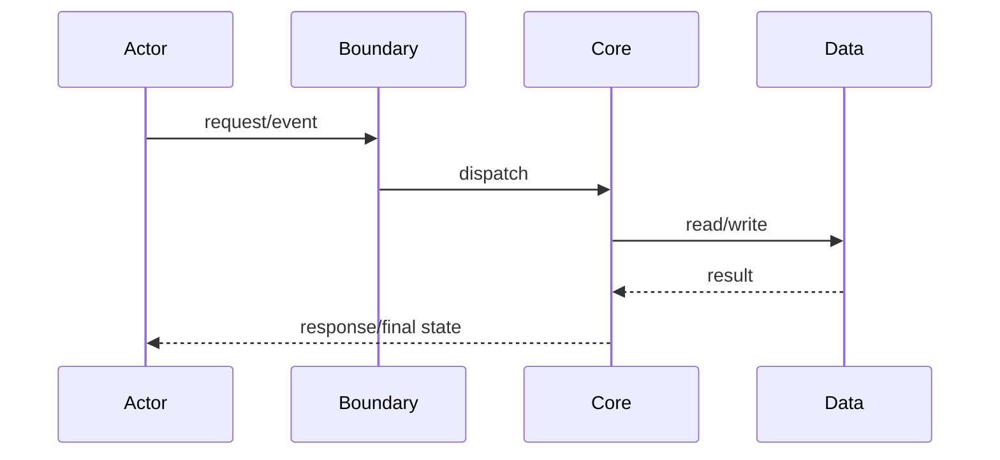

# KP-XXX: Critical Path Name

## Scenario Definition

| Field | Value |
|---|---|
| Repository / Revision |  |
| Actor |  |
| External stimulus |  |
| Initial state |  |
| Build target |  |
| Runtime config |  |
| Feature flags |  |
| Expected final state |  |
| Oracle |  |
| Runtime evidence | Not run / trace ID / test |

## Path Summary

## Path Steps

| Step | Trigger/caller | Component and symbol | Input | State before→after | Side effects | Error/timeout/retry/degradation | Claim | Evidence | Confidence |
|---:|---|---|---|---|---|---|---|---|---|

## Data Flow

| Data | Source | Transformation | Consumer | Final destination | Sensitivity | Evidence |
|---|---|---|---|---|---|---|

## Branches and Boundary Conditions

| Condition | Branch | Result | Observability | Evidence |
|---|---|---|---|---|

## MAY versus OBSERVED

| Relationship | Static result | Runtime result | Explanation or unknown |
|---|---|---|---|

## Counter-Hypotheses

| Claim | Counter-hypothesis | Validation result | Status |
|---|---|---|---|

## Remaining Unknowns

| Unknown ID | Unknown | Severity | Next validation action |
|---|---|---|---|
