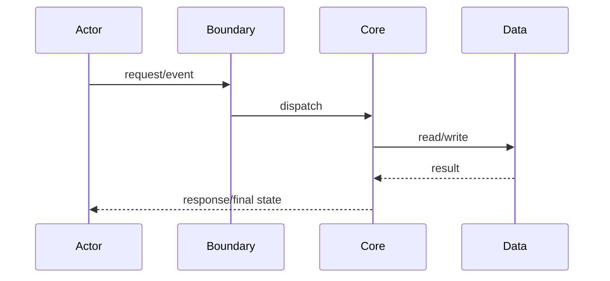

# KP-XXX：关键链路名称

## 场景定义

| 字段 | 内容 |
|---|---|
| Repository / Revision |  |
| 参与者 |  |
| 外部刺激 |  |
| 初始状态 |  |
| Build target |  |
| Runtime config |  |
| Feature flags |  |
| 预期最终状态 |  |
| Oracle |  |
| 运行证据 | 未执行 / trace-id / test |

## 链路摘要

## 逐步链路

| 步骤 | 触发/调用者 | 组件与符号 | 输入 | 状态前→后 | 副作用 | 异常/超时/重试/降级 | Claim | 证据 | 置信度 |
|---:|---|---|---|---|---|---|---|---|---|

## 数据流

| 数据 | 来源 | 转换 | 消费者 | 最终落点 | 敏感性 | 证据 |
|---|---|---|---|---|---|---|

## 分支和边界条件

| 条件 | 分支 | 结果 | 可观测性 | 证据 |
|---|---|---|---|---|

## MAY 与 OBSERVED 差异

| 关系 | 静态结果 | 运行结果 | 解释或未知 |
|---|---|---|---|

## 反假设

| Claim | 反假设 | 验证结果 | 状态 |
|---|---|---|---|

## 剩余未知

| 未知 ID | 未知 | 严重度 | 下一验证动作 |
|---|---|---|---|
