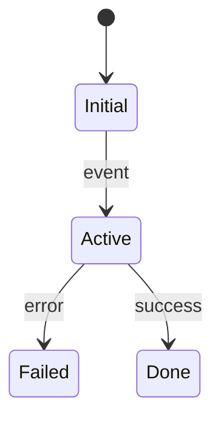

# Data and State Map

## Primary Entities

| Entity | Owner | Storage | Creator | Readers | Writers | Lifecycle | Evidence |
|---|---|---|---|---|---|---|---|

## State Machines

### State object: `<name>`

| Transition | Trigger | Preconditions | Write location | Side effects | Failure semantics | Evidence | Confidence |
|---|---|---|---|---|---|---|---|

## Transactions and Consistency

| Operation | Boundary | Atomicity | Idempotency | Concurrency control | Compensation/recovery | Evidence |
|---|---|---|---|---|---|---|

## Caches

| Cache | Source of truth | Key | Population | Invalidation | Consistency risk | Evidence |
|---|---|---|---|---|---|---|

## Unverified State Behavior

| Unknown ID | Behavior | Risk | Required runtime scenario |
|---|---|---|---|
