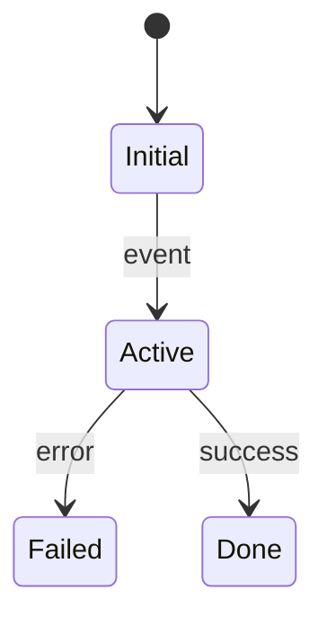

# 数据与状态地图

## 主要实体

| 实体 | 所有者 | 存储位置 | 创建者 | 读者 | 写者 | 生命周期 | 证据 |
|---|---|---|---|---|---|---|---|

## 状态机

### 状态对象：`<name>`

| 转换 | 触发 | 前置条件 | 写入位置 | 副作用 | 失败语义 | 证据 | 置信度 |
|---|---|---|---|---|---|---|---|

## 事务与一致性

| 操作 | 边界 | 原子性 | 幂等策略 | 并发控制 | 补偿/恢复 | 证据 |
|---|---|---|---|---|---|---|

## 缓存

| 缓存 | Source of truth | Key | 填充 | 失效 | 一致性风险 | 证据 |
|---|---|---|---|---|---|---|

## 未验证状态行为

| 未知 ID | 行为 | 风险 | 需要的运行场景 |
|---|---|---|---|
