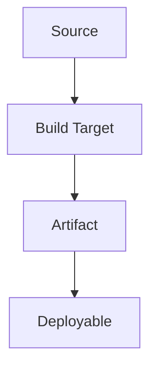

# 可执行与部署拓扑

## 构建和部署关系

## 可执行单元

| ID | 名称 | 类型 | 构建目标 | 入口 | 产物 | 部署位置 | 依赖服务 | 所有者 | 证据 |
|---|---|---|---|---|---|---|---|---|---|

## 启动与关闭

| 单元 | 启动流程 | 就绪条件 | 健康检查 | 关闭流程 | 证据 |
|---|---|---|---|---|---|

## 生成关系

| Source of truth | Generator | Generated output | Consumer | 更新命令 | 证据 |
|---|---|---|---|---|---|

## 未映射单元

| 候选 | 为什么疑似可执行单元 | 缺失证据 | 下一动作 |
|---|---|---|---|
