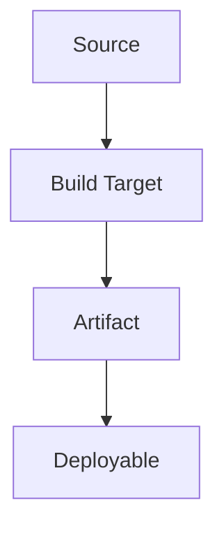

# Executable and Deployment Topology

## Build and Deployment Relationships

## Executable Units

| ID | Name | Type | Build target | Entry point | Artifact | Deployment location | Required services | Owner | Evidence |
|---|---|---|---|---|---|---|---|---|---|

## Startup and Shutdown

| Unit | Startup path | Readiness condition | Health check | Shutdown path | Evidence |
|---|---|---|---|---|---|

## Generated Relationships

| Source of truth | Generator | Generated output | Consumer | Update command | Evidence |
|---|---|---|---|---|---|

## Unmapped Units

| Candidate | Why it may be executable | Missing evidence | Next action |
|---|---|---|---|
