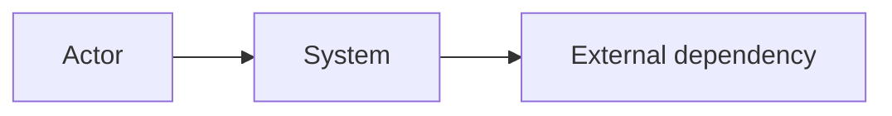

# 系统概览

## 分析范围

- Repository:
- Revision:
- Mode:
- Included:
- Excluded:
- Build/runtime scope:

## 系统目标

### 用户与参与者

| 参与者 | 目标 | 主要入口 | 证据 | 置信度 |
|---|---|---|---|---|

### 主要能力

| 能力 | 用户价值 | 入口 | 结果/最终状态 | 证据 | 置信度 |
|---|---|---|---|---|---|

### 非目标与边界

## 系统上下文

## 关键可执行单元

| 单元 | 职责 | 构建目标 | 入口 | 部署形态 | 证据 |
|---|---|---|---|---|---|

## 代表性场景

| 场景 ID | 参与者 | 触发 | 初始状态 | 最终状态 | Oracle | 链路资产 |
|---|---|---|---|---|---|---|

## Intended 与 As-built 差异

| 预期 | 实际 | 差异 | 风险 | 证据 |
|---|---|---|---|---|

## 最高风险未知

| 未知 ID | 未知 | 严重度 | 影响 | 下一验证动作 |
|---|---|---|---|---|
