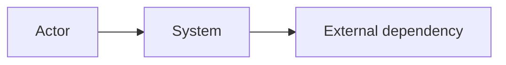

# System Overview

## Analysis Scope

- Repository:
- Revision:
- Mode:
- Included:
- Excluded:
- Build/runtime scope:

## System Goals

### Users and Actors

| Actor | Goal | Primary entry point | Evidence | Confidence |
|---|---|---|---|---|

### Primary Capabilities

| Capability | User value | Entry point | Result/final state | Evidence | Confidence |
|---|---|---|---|---|---|

### Non-Goals and Boundaries

## System Context

## Critical Executable Units

| Unit | Responsibility | Build target | Entry point | Deployment form | Evidence |
|---|---|---|---|---|---|

## Representative Scenarios

| Scenario ID | Actor | Trigger | Initial state | Final state | Oracle | Path asset |
|---|---|---|---|---|---|---|

## Intended versus As-Built Differences

| Intended | Actual | Difference | Risk | Evidence |
|---|---|---|---|---|

## Highest-Risk Unknowns

| Unknown ID | Unknown | Severity | Impact | Next validation action |
|---|---|---|---|---|
