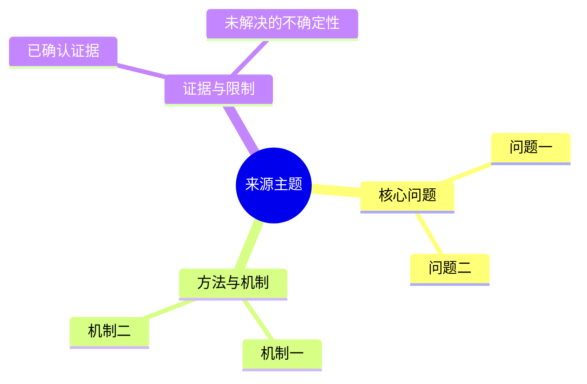

# Wiki

Manage the vault as two cooperating systems:

- Treat `00-Inbox/`, `01-Daily/`, `02-Projects/`, `03-Knowledge/`, and `04-Sources/` as the human-owned workspace. Keep sensitive records in Git-ignored `90-Private/`. Preserve the user's wording and low-friction capture style.
- Treat `_wiki/` as the LLM-maintained compiled knowledge layer. Keep it structured, sourced, linked, and cumulatively updated.

Read [references/vault-profile.md](references/vault-profile.md) for this vault's identity and conventions. Read [references/workflows.md](references/workflows.md) before ingesting, organizing, compiling, or repairing notes. Use `scripts/find_vault.py` on both macOS and Linux; run `scripts/audit_vault.py` for a deterministic health inventory.

## Orient Before Acting

1. Set `WIKI_SKILL_DIR` to the directory containing this `SKILL.md`, then run `python3 "$WIKI_SKILL_DIR/scripts/find_vault.py"`. Use its resolved path for every read and write in the turn.
2. Discovery must prefer an explicit user path, `OBSIDIAN_VAULT_PATH`, and the current workspace. Otherwise use `/Users/w/Library/Mobile Documents/iCloud~md~obsidian/Documents/wiki` on macOS and `/home/w/Documents/Obsidian` on Linux.
3. Read the nearest `AGENTS.md` and obey it.
4. Inspect `git status --short`; treat all existing changes as user-owned.
5. For formal wiki work, read `_wiki/SCHEMA.md`, `_wiki/index.md`, and recent `_wiki/log.md` entries.
6. Inventory the requested scope, links, attachments, duplicate names, and candidate destinations before editing.
7. Search both filenames and content before creating a page. Prefer improving an existing canonical page over creating a near-duplicate.
8. Give raw source records and formal pages distinct basenames (for example, `topic-source.md` for raw and `topic.md` for formal); otherwise basename resolution makes wikilinks ambiguous. When setting a raw `sha256`, hash the exact body returned after the closing `\n---\n` frontmatter delimiter, then run `audit_vault.py` to confirm no `raw-hash-drift`.
9. Before creating or substantially rewriting `_wiki/raw/`, read `references/raw-structure.md`. Keep the governance/frontmatter envelope stable, but make the raw body a source-faithful deep analysis and structured summary that follows the original material's structure. It must cover the source's substantive claims, reasoning, evidence, assumptions, and limitations when recoverable—not just a short abstract or metadata card; never impose a universal Markdown body template.
10. Before creating or substantially rewriting `_wiki/concepts/`, or deciding whether a source unit deserves a concept/entity/comparison page, read `references/concept-quality.md`. Keep the semantic invariants stable, but choose the prose structure from the concept's actual role; do not turn every source chapter into a canonical concept.
11. For formal-page maintenance, preserve or assign `page_role` and `evidence_scope` according to `_wiki/SCHEMA.md`; inspect the review queue in `_wiki/index.md` before treating `confidence: high` as a cross-source or production claim.

Do not turn a read-only request such as “分析”, “审查”, or “给建议” into edits. When the user asks to create, manage, organize, ingest, compile, or fix, perform the scoped edits and validate them.

## Choose the Operation

- **Capture:** Create a human note from the matching `_meta/templates/` template. Keep capture friction low; ordinary notes need no formal frontmatter.
- **Organize:** Classify and move only clearly scoped human notes. Preserve ambiguous, mixed-purpose, empty, or unclear notes in place and report them.
- **Ingest/compile:** Preserve the source, extract evidence, and update the relevant `_wiki` pages instead of merely creating a standalone summary. The raw record is a source-faithful deep analysis and structured summary, not a short abstract, metadata card, or fixed summary template.
- **Query:** Read the index, search broadly, synthesize from actual pages, and distinguish sourced facts from personal or unsourced notes. Persist only when requested or when the request explicitly asks to manage the wiki.
- **Lint/repair:** Audit first, separate definite defects from heuristics, then make only authorized fixes.

## Raw Record Structure Requirement

Before writing a raw record, load `references/raw-structure.md`. The body must mirror the original material's information architecture whenever recoverable: for a book/EPUB, follow its TOC and chapter/subsection hierarchy; for a paper, report, article, transcript, or slide deck, follow the source's own headings, clauses, timestamps, speakers, or slide order. Analyze and summarize each substantive source unit in place, preserve source order, and retain the reasoning, evidence, assumptions, and limitations needed to understand the material without reopening the source.

Do not force raw records into a universal sequence such as `Summary → Key claims → Key facts → Limitations → Provenance`. Those labels may be used only when the source itself uses them or when a very small provenance note is genuinely needed and has no natural source location. Keep cross-source synthesis and knowledge-graph interpretation in formal `_wiki/` pages. Fixed frontmatter and body hashing remain mandatory; the prose structure is source-dependent.

## Mermaid Summary Map for Raw Records

After completing the source-faithful deep analysis of any article, paper, report, technical document, transcript, or other structured text recorded under `_wiki/raw/`, append a concise, source-local Mermaid `mindmap` at the end of the raw body. This is a fixed visual appendix, not a replacement for the detailed analysis and not a place for cross-source synthesis; it does not change the source-specific structure of the preceding body.

- Build the map only from claims, sections, mechanisms, evidence, limitations, and uncertainties already established in the raw record. Preserve the source's native structure and order rather than inventing a generic outline.
- Put the map in a final `## 结构导图（Mermaid）` subsection and use a renderable Mermaid fenced block, for example:



- Use the source title or topic as the root, keep node labels short, and include only categories the source actually supports. Do not copy paragraphs into the diagram.
- If retrieval is incomplete, reflect the reviewed scope and uncertainty in the map; never draw missing content as a confirmed conclusion.
- Append the diagram only after the raw analysis is complete, then recompute the raw body SHA-256 and run `audit_vault.py` to confirm no `raw-hash-drift`.

## Prose Quality and Anti-Template Discipline

Governance fields and semantic invariants are acceptance criteria, not a sentence or heading template. Before drafting, derive the smallest outline that fits the source or concept; do not mechanically instantiate the same section sequence for every ingest.

- A raw record should read like a structured reading record, not like a report about a report. Preserve the source's native headings and order, then write from the claims, mechanisms, evidence, and examples in that unit.
- A formal concept should read like a durable explanation of an idea or mechanism, not like a second abstract. Start with the concept's role and interfaces, then add only the mechanism, boundaries, evidence, and relationships that the concept actually needs.
- Avoid repetitive attribution leads such as “文章……”, “作者指出……”, or “来源描述……” across adjacent paragraphs. Name the actor, mechanism, decision, evidence, or condition directly when attribution is already clear.
- Do not repeat the same provenance marker, block-range formula, caveat sentence, or “source says / wiki infers” preamble in every paragraph. Put location markers at the smallest useful source unit and keep uncertainty next to the claim it qualifies.
- Do not create generic headings such as `Scope`, `Summary`, `Key claims`, or `Evidence boundary` solely because a checklist contains those words. Use them only when they clarify this particular source or concept; otherwise express the boundary in natural prose.
- Before accepting a draft, scan paragraph openings and section transitions for mechanical repetition. If several neighboring paragraphs have the same grammatical lead, rewrite them around their actual subject rather than rotating synonyms mechanically.
- Do not polish a source into uniform AI prose. Source-faithful analysis may be uneven in length and emphasis when the material itself is uneven.

## Paper and Technical-Source Detail Requirement

For papers, technical reports, standards, and implementation documents, do not produce an abstract-only or metadata-only ingest. Before writing the raw record or synthesis page:

1. Read the source deeply enough to cover the problem definition, assumptions, method/system pipeline, important equations or objective functions, training or optimization procedure, datasets, evaluation protocol, baselines, quantitative results, ablations, runtime/resource conditions, limitations, and stated future work.
2. Separate the paper's direct claims from the assistant's knowledge-graph interpretation. Every important number must retain its dataset, split/sequence, metric direction, viewpoint (training/novel/closed-loop), hardware, and other protocol boundaries.
3. Explain why the method works and what each major module contributes; do not merely list module names. For algorithm papers, include the data flow and the role of key losses, thresholds, constraints, or update rules when present.
4. Reconcile strengths with counterexamples and failure cases. Do not report only the best table or headline number, and do not generalize indoor, synthetic, benchmark, or rendering results to production autonomous driving without evidence.
5. Use the raw record for detailed evidence arranged in the source's own structure and the formal page for a structured technical synthesis. Do not impose a fixed raw sequence on a paper, book, or other material. The formal page may be concise, but it must still contain the core mechanism, experimental interpretation, limitations, and at least two meaningful links. If the source cannot be read completely enough, record the retrieval/completeness limitation and lower confidence rather than filling gaps by inference.
6. For every paper ingest, report which sections were actually reviewed and whether any claims remain uncertain or protocol-dependent.

A paper ingest is incomplete if it only contains title/authors/year, a short abstract paraphrase, a few generic links, or unqualified benchmark numbers.

## Ingest X Sources Safely

When the source is an `x.com`/`twitter.com` post or Article, read [references/x-ingest.md](references/x-ingest.md) before retrieval. Keep the original X URL as the canonical source and record the actual retrieval method, access date, and any fallback or completeness limitation in the raw record. Do not treat an empty short-post field as proof that an Article has no body. Before semantic duplicate search, normalize and compare the exact X `post_id` and, for Articles, `article_id`; same author/title/topic with a different ID is not a duplicate.

## Protect Authorship and Provenance

- Never rewrite a human note into polished AI prose merely to make it uniform.
- Keep direct observations, personal reflections, plans, and tentative ideas recognizable as the user's material.
- Do not fabricate a source, author, date, URL, quote, or confidence level.
- Treat external source files and existing `_wiki/raw/` bodies as evidence. Do not silently alter them during synthesis.
- Never put X cookies, `auth_token`, `ct0`, Bearer tokens, browser session data, or other credentials in the vault, source metadata, logs, shell history, or committed files.
- When a human note has traceable context but no external source, cite the note path where the schema permits it and label the compiled claim conservatively. Otherwise use `status: needs-source` and `confidence: low`.
- Record contradictions side by side with source and date. Do not flatten disagreement into a false consensus.
- Paraphrase sources; retain only short excerpts needed for verification and preserve attribution.

## Maintain the Compiled Wiki

For every created or materially updated formal page:

1. Use a lowercase kebab-case filename and the matching `_wiki/_templates/` page type.
2. Maintain every frontmatter field required by `_wiki/SCHEMA.md`, including `page_role` and `evidence_scope` for formal pages after this schema revision.
3. Add only schema-approved tags.
4. Make important claims traceable through `sources` and inline context where useful.
5. Add at least two useful outgoing wikilinks; do not create empty placeholder pages solely to satisfy this count. Prefer relationship sentences or inline links over a bare `Related` list.
6. Reconcile the new evidence with related pages, including contradictions and stale claims.
7. Update `_wiki/index.md` once per batch, including the review queue when page status or evidence scope changes.
8. Append one structured, parseable entry to `_wiki/log.md` once per batch. Include source, action, created/updated/unchanged pages, uncertainties, and validation; preserve historical log entries.

Prefer one-source-at-a-time ingestion unless the user requests a batch. A source should change every relevant existing synthesis page, but touch only pages justified by its evidence.

## Organize Human Notes Conservatively

- Use semantic destination rules from `vault-profile.md`, not filename guessing alone.
- Before moving, check exact Obsidian wikilinks, embedded assets, name collisions, aliases, and backlinks.
- Move content without silently editing its meaning. Make only link/path adjustments required by the move unless content editing was requested.
- Update exact backlinks after a move and verify the destination and attachments exist.
- Do not delete source notes after compilation. Do not use permanent deletion as a cleanup shortcut.
- Keep uncertain candidates in place and return a short decision list.

## Validate and Report

Run checks proportional to the change:

```bash
WIKI_SKILL_DIR="/path/to/installed/wiki"
WIKI_VAULT="$(python3 "$WIKI_SKILL_DIR/scripts/find_vault.py")"
python3 "$WIKI_SKILL_DIR/scripts/audit_vault.py" --vault "$WIKI_VAULT"
git -C "$WIKI_VAULT" diff --check -- path/to/changed-note.md
git -C "$WIKI_VAULT" status --short
```

For `_wiki` edits, also verify required frontmatter, `page_role`, `evidence_scope`, non-empty or conservatively handled `sources`, outgoing links, index coverage, review-queue coverage, log entry, and exact broken-link results. Open changed notes in Obsidian when embeds or layout changed.

Report:

- files created, updated, or moved;
- what was intentionally left unchanged and why;
- sources and uncertainties;
- validation performed and any pre-existing unrelated failures.

Never stage, commit, push, reset, or absorb unrelated changes unless the user separately authorizes that Git action.
