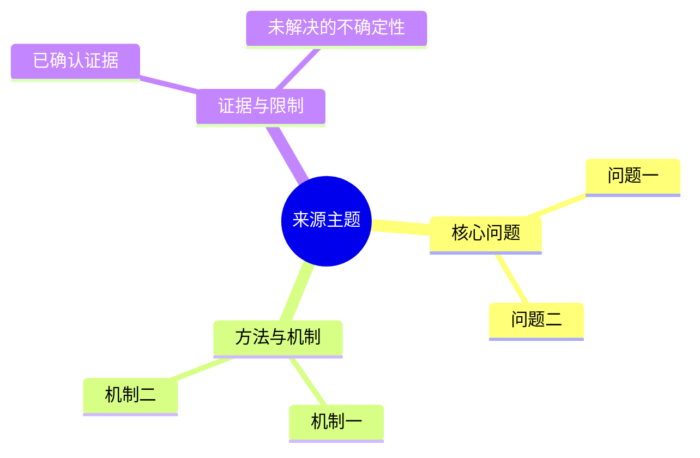

# Source-faithful Raw Record Structure

Use this reference whenever creating or substantially rewriting a `_wiki/raw/` ingestion record from an attachment, local file, URL capture, transcript, or other source material.

This is a **decision policy, not an output template**.

## Non-negotiable rule

The raw record body must follow the information architecture of the original material whenever that structure can be recovered. A deterministic metadata/frontmatter block is allowed and required by the live schema, but the Markdown body must not be forced into a universal set of headings such as `Summary`, `Key claims`, `Key facts`, `Limitations`, and `Provenance`.

Apply these rules:

- preserve the source's order, hierarchy, numbering, labels, and grouping;
- reuse the source's own table of contents, chapter names, section headings, slide labels, timestamps, or speaker turns when available;
- deeply analyze, summarize, and paraphrase each source unit at the location where it occurs instead of flattening the material into a topic list; make the unit's claim, reasoning, evidence, assumptions, and limitations explicit when the source supports them;
- omit sections that do not exist in the source; never create empty placeholder sections merely to match a template;
- merge only obvious extraction artifacts, such as duplicated headings or a heading split across adjacent lines, and do not silently invent missing structure;
- keep cross-source synthesis, reusable concept definitions, and broad judgments in formal `_wiki/` pages, not in the raw record;
- place extraction limitations, uncertain equations, figure/diagram caveats, and missing-section notes next to the affected source unit whenever possible;
- extract substantive source images into `_wiki/raw/assets/<raw-stem>/` and embed them at their original source position in the raw body; a remote URL or empty placeholder is not sufficient when the image can be retrieved;
- preserve enough location information that a reader can map a raw paragraph back to the source.

The raw record should be a source-faithful deep analysis and structured summary, not a polished concept page, not a short abstract or metadata card, and not a full copyrighted transcription. It should preserve the source's structure while explaining the substantive claims, reasoning, evidence, assumptions, limitations, and relationships needed for later synthesis without reopening the source.

## Choose the structure from the material

Use the strongest structure actually present in the source:

- **Book / EPUB:** follow the TOC and the hierarchy `part → chapter → section → subsection`; retain chapter numbers and original section labels. A root record may provide the book map, while child records may mirror chapters or other natural source units. Split by source boundaries, not by a fixed number of paragraphs or a fixed list of headings.
- **Research paper:** follow the paper's actual section hierarchy and numbering. Use `Abstract`, `Introduction`, `Method`, `Experiments`, `Limitations`, or `Appendix` only when the source contains corresponding sections; do not assume every paper has all of them.
- **Technical report / standard / manual:** preserve clauses, chapters, requirements, examples, annexes, and revision structure as authored.
- **Web article / essay:** preserve the original heading nesting and narrative order, including a source-provided FAQ, chronology, or argument sequence when present.
- **Video / podcast / transcript:** use timestamps, chapters, speakers, or conversation turns; do not force written-article sections onto spoken material.
- **Slide deck:** use deck sections and slide order; keep slide numbers or titles when they are useful for traceability.
- **Dataset / benchmark / release notes:** follow the source's own schema, version, task, split, change-log, or table organization.
- **Unstructured material:** infer the least-assumptive sequence from the material and explicitly state that the structure was inferred rather than source-authored.

## Book and EPUB handling

For a book or EPUB in particular:

1. Treat the EPUB TOC/spine and chapter XHTML headings as the primary structural evidence.
2. Keep the book-level record as a map of the book's real parts and chapters; do not turn it into a generic “book summary” with identical sections for every book.
3. For chapter-level records, preserve the chapter's own subsection order. Put examples, exercises, references, formulas, figures, and code discussion under the chapter section where they occur rather than moving all of them into a universal “technical evidence” block.
4. Preserve the distinction between the book's exposition and claims it merely cites from external papers, datasets, companies, or standards. A cited result is not independently verified just because it appears in the book.
5. Keep formulas, tables, diagrams, and code excerpts paraphrased or minimally transcribed only when needed to explain the source. Mark image/MathML/OCR/extraction uncertainty at the relevant location.
6. If the source has no reliable heading hierarchy, use chapter boundaries and reading order as the fallback; do not fabricate fine-grained subsection names.

## Frontmatter, provenance, and copyright boundary

- Keep the required raw frontmatter stable: source identity, author, dates, original path/URL, attachment references, access method, and body SHA-256 where the vault schema requires them.
- The frontmatter is the governance envelope; it does not authorize a fixed body layout.
- Preserve the original binary or canonical source copy separately when applicable. A raw deep analysis and structured summary should not become a second independently editable full-text copy.
- Paraphrase source prose and retain only short evidence-bearing excerpts needed for verification. Preserve headings and labels for navigation, but do not copy an entire copyrighted book or article into the raw record by default.

## Prose quality: source-faithful without report templates

Source fidelity concerns both structure and voice. Keeping the original headings does not justify writing every paragraph as a meta-report about what “the article” or “the author” said.

- Open a unit with its actual subject: an actor's decision, a mechanism, an experiment, a requirement, an example, or a limitation. Use attribution when it resolves uncertainty, not as a compulsory sentence prefix.
- Do not repeat one grammatical pattern such as `文章/作者/来源 + 动词 + 结论` across neighboring paragraphs. Do not mechanically rotate synonyms to hide the repetition; change the sentence focus to match the source unit.
- Keep source locations, retrieval caveats, and attribution close enough to preserve traceability, but group them at the section or claim level when paragraph-level repetition adds no information.
- A short provenance note may explain retrieval and completeness once. It must not become a second fixed ending or a disclaimer attached to every section.
- The result should be a readable, unevenly weighted reading record. A source with a long technical section and a short historical aside should not be flattened into equally sized template blocks.

## Figures, diagrams, and source images

Images are part of the source's information architecture when they carry a figure, diagram, screenshot, chart, table, or other substantive content. Handle them during capture rather than leaving image URLs for a later pass:

1. Enumerate Markdown/HTML image references, lazy-loaded variants, X Article media, EPUB image members, and PDF-embedded figures in source order. Ignore tracking pixels, decorative icons, unrelated thumbnails, and avatars unless they are evidence in the source.
2. Download or extract the original bytes to `_wiki/raw/assets/<raw-stem>/` with stable ordinal names (`001-figure.png`, `002-screenshot.jpg`, …). Check the actual MIME/content before choosing the extension and retain the source's canonical URL. Never archive credentials, cookies, browser state, or signed session URLs.
3. At the corresponding section, paragraph, page, slide, timestamp, or nearest recoverable block, insert a vault-local embed such as `![[_wiki/raw/assets/<raw-stem>/001-figure.png|原始 alt 或 caption]]`. Preserve captions, figure numbers, alt text, and surrounding prose in place; do not collect figures at the end of the note.
4. Keep the raw Markdown body image-focused: insert the vault-local embed and source-provided alt text/caption only; never add or display inline HTML provenance comments, and do not print the image source URL beside the image. Store the source URL, source location, local path, extraction result, media type, and byte SHA-256 in `_wiki/raw/assets/<raw-stem>/_provenance.json`. If placement is approximate because the extractor lost the exact anchor, record that in the sidecar, not as a visible source URL or HTML comment. Do not infer a caption or visual claim that was not recoverable from the source.
5. Validate that every local image is non-empty and decodable, every embed resolves, and every sidecar record matches the archived bytes. If an image fails, retain `[图片未成功归档：原因]` without the original URL in the raw body, record the safe URL and affected source location in the sidecar/private validation output, and mark the capture partial rather than silently omitting it. Recompute `sha256` after all image embeds, failure markers, and the final Mermaid block are finished.

## Mermaid Visual Summary

Every raw record for an article, paper, report, technical document, transcript, or other structured text must end with a concise, source-local Mermaid `mindmap` after the source-faithful analysis is complete. This visual appendix is the only fixed final section permitted by this rule; it must not flatten the preceding source-specific structure, replace the deep analysis, or introduce cross-source synthesis.

- Build the map only from content already established in the raw record: source sections, claims, mechanisms, evidence, limitations, and uncertainties. Preserve the source's order and omit unsupported categories.
- Use a final `## 结构导图（Mermaid）` subsection with a renderable fenced block. Keep the root equal to the source topic/title, keep nodes short, and do not copy paragraphs into the diagram:

- If retrieval or extraction is incomplete, represent the reviewed scope and uncertainty explicitly; never turn missing material into a confirmed node.
- Add the diagram only after the final raw analysis text is written. Recompute the body SHA-256 over the complete body, including the Mermaid block, and run `audit_vault.py` to check for `raw-hash-drift`.

## Acceptance checks

Before considering a raw record complete, verify:

- a reader can see the original material's structure and order;
- the record explains the source's substantive reasoning, evidence, assumptions, and limitations rather than only listing its title, thesis, or headline claims;
- each substantive block is attributable to a source section, page, slide, timestamp, speaker turn, or other location;
- no generic fixed headings were inserted solely because the skill expected them;
- source-specific caveats remain next to the evidence they qualify;
- substantive source images are locally archived and embedded at their source positions, or explicit failure markers and provenance remain where extraction failed;
- every local image embed resolves to an existing decodable asset and its provenance/hash record matches the archived bytes;
- the body hash was recomputed after the final edit, including the Mermaid block;
- the raw body ends with a renderable, source-local Mermaid `mindmap` whose nodes are supported by the preceding analysis and whose uncertainty matches the retrieval boundary;
- the formal page, not the raw record, carries cross-source synthesis and reusable knowledge-graph interpretation.
